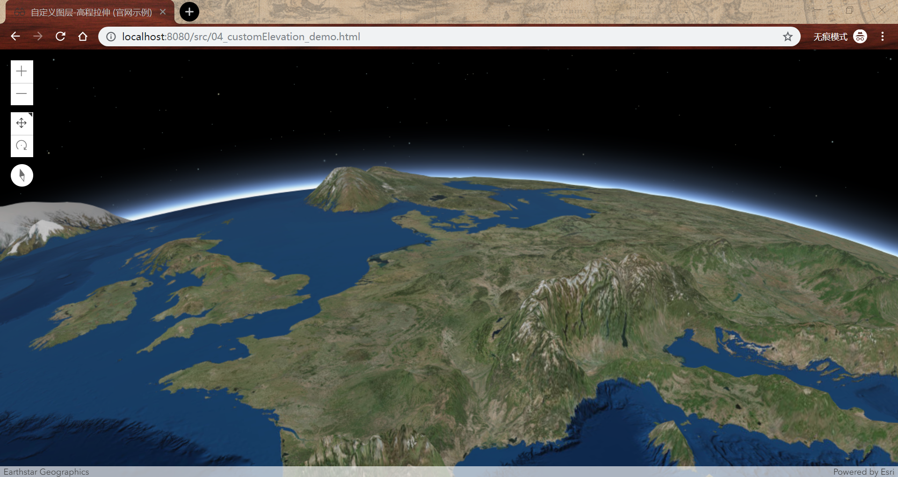
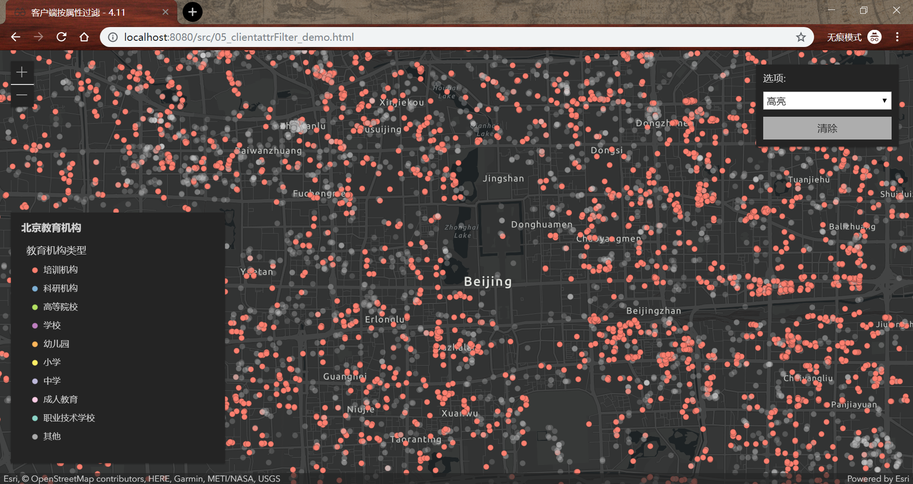
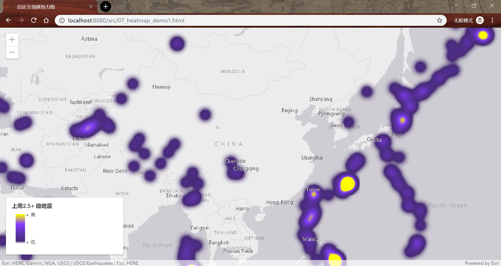
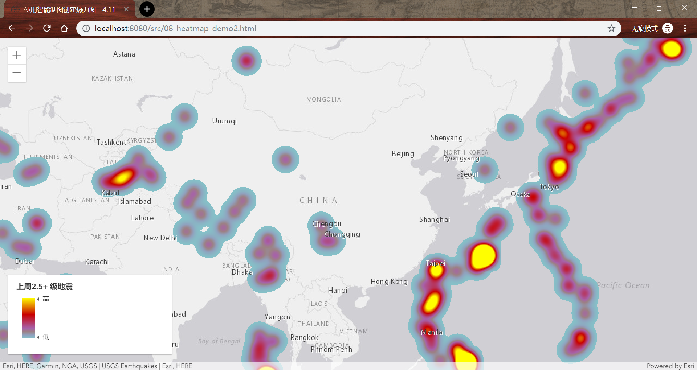
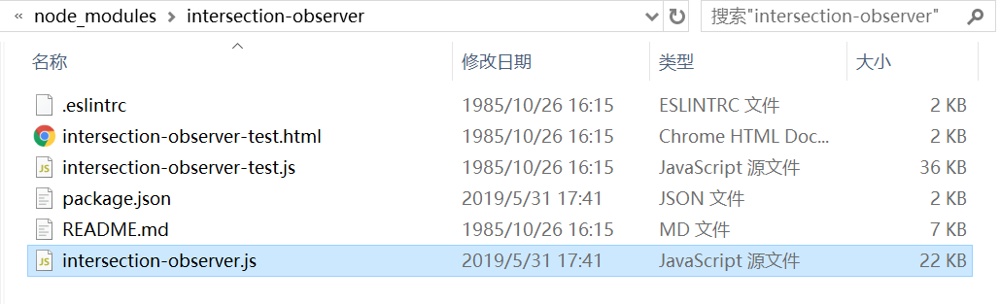
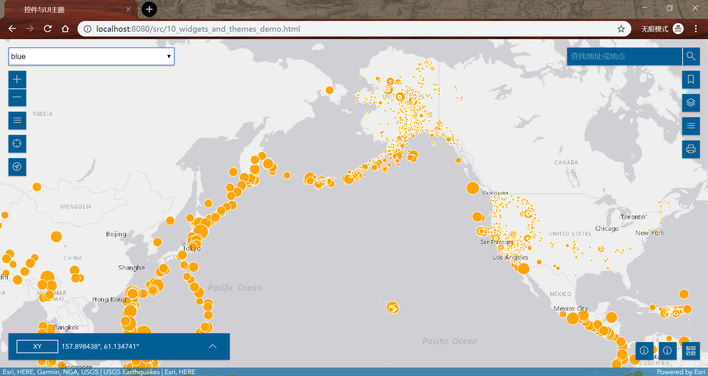
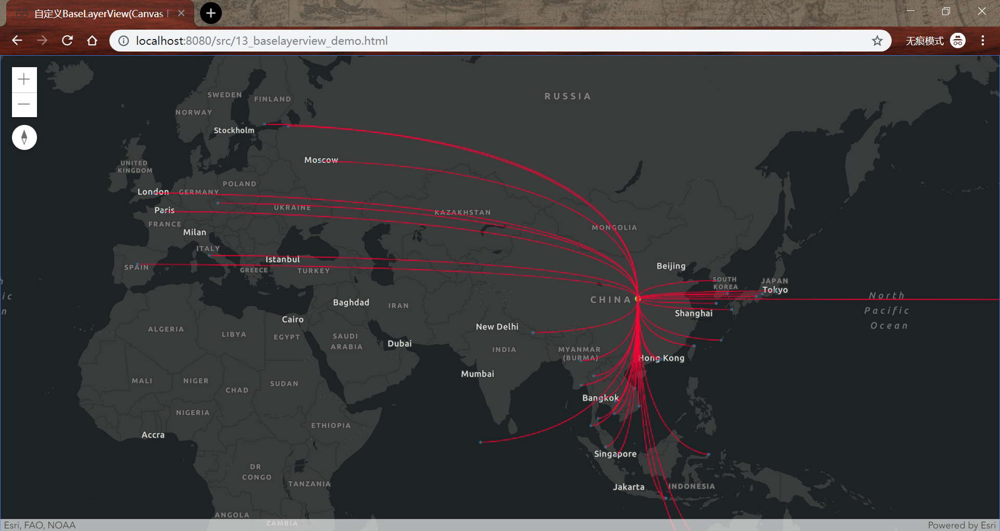
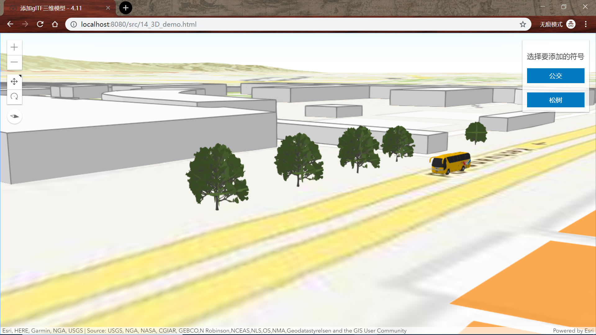
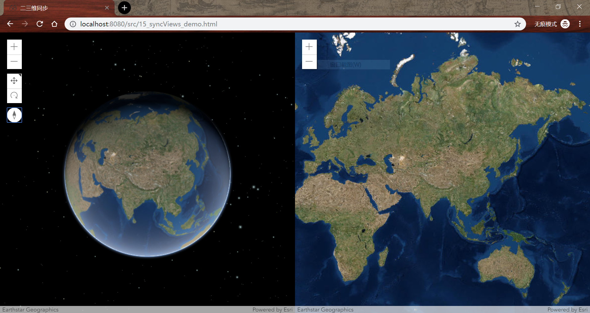
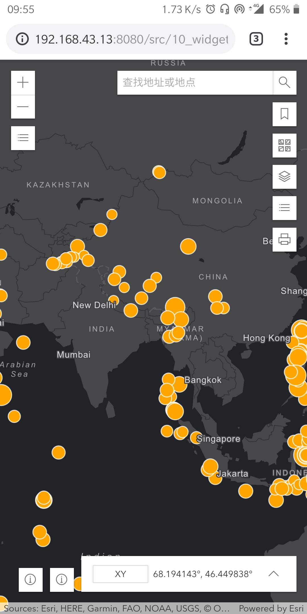

# ArcGIS JS API 4.11 示例

## ArcGIS JS API 高级开发 (2019 Esri 空间信息技术开发者大会)

---

### 前言

这些代码主要面向初学 ArcGIS JS API 4.x 的开发人员。示例代码都相对简单，数据大多也用的 GeoJSON 格式（但编辑控件必须使用 FeatureLayer，所以对应的示例内调用的是 online 上的一个可编辑的 Feature Service）。
大概说一下代码的组织方式，ArcGIS JS API 使用 npm 安装的，所以在 node_modules 里，用的不是 CDN 上的库。每一个 demo 有一个 html 文件及一个 js 文件。所有的 js 文件存储路径为[src/app/](./src/app)。使用也很简单，按照下面命令来就好了。当然，需要提前安装[nodejs](https://nodejs.org/en/)。

_PS：我是在 windows 环境下做的，按道理来讲 linux 或者 MacOS 环境下一样运行方式没有什么区别，但我没测试_:innocent:

```
$npm install
$http-server
```

其中，[示例 9](#editor) 和 [示例 10](#themes) 都需要一些操作，具体请看下文。

### Demo 内容

1. Accessor

Accessor 是 JS API 4.x 中的一个重要抽象类，它是 JS API 中多数接口的基类。但其实不需要特别懂原理，明白 Accessor 能让我们很简单的去访问/更改对象的属性，监听属性的变化就可以了。
它另外一个比较重要的能力是 Autocast（自动映射），就是在创建对象的时候，不需要去调用对应的构造函数，JS API 自己内部去进行构建了，我们只需要按照规则传入一个 object 就 ok 了。

下面两段代码是实现相同的样式定义，这种就是我们上面所提到的 Autocast。通过 Autocast，我们不需要去调用专门的接口。如果不确定在什么情况下才可以使用，去官网文档上查查一下接口的文档，一般示例代码上会显示当前的接口可不可以使用 Autocast 这种方式。

```
// 4.x
var markerStyle = {
    type: "simple-marker",
    style: "square",
    color: "red",
    size: 10,
    outline: {
        color: "rgba(255, 255, 255, 0.5)",
        width: 4
    }
};
// 3.x 方式，4.x可用
var markerStyle = new SimpleMarkerSymbol(
    SimpleMarkerSymbol.STYLE_SQUARE,
    10,
    new SimpleLineSymbol(
        SimpleLineSymbol.STYLE_SOLID,
        new Color([255, 255, 255, 0.5]),
        4
    ),
    new Color([255, 0, 0])
);
```

在[01_accessor_demo.html](/src/app/Person.js)中，创建了一个继承了 Accessor 的类（Person）。Person 有 firstname, lastname 及 fullname 三个属性。整个代码很简单，主要是想说明 Accessor 对属性读取、赋值以及监听的简便性。

2. Promise

刚接触 JS 就知道它是单线程异步的。起初异步操作都是直接拿回调函数处理的，现在大多都用 Promise 了。其实本质上并没什么区别，但是使用 Promise 可以避免以前会陷入的回调地狱，使代码更加整洁易于维护。Promise 代表了异步操作完成后的返回值。当触发了一个异步操作的时候，Promise 会承诺在不远的将来给你一个回应，无论成功或失败（还是代码的承诺比较靠谱）。Promise 共有三个状态：pending（表示挂起，等待异步操作的完成，为初始状态）, resolved（表示异步操作完成并成功）, rejected（表示异步操作完成并失败）。

自己怎么去构建一个 Promise 就不细讲了，网上有很多资源。这里提 Promise 的主要原因是，在 Web GIS 中，我们会遇到很多异步操作：加载空间数据、空间数据的处理与分析、渲染等。在 ArcGIS JS API 中，使用 Promise 的方式与 ES6 中的没有什么区别。_then()_ 是 Promise 中重要的方法，定义了 Promise 解析成功的回调函数，回调函数的参数为 Promise 解析成功后的返回值。_catch()_ 则是用于处理 Promise 解析失败的方法。常见的 Promise 使用的模式如下：

```
someAsyncFunction()
  .then(function(resolved_value) {
    console.log(resolved_value);
  }).catch(function(error) {
    console.error(error);
  });
```

针对 JS API 中的错误信息具体参考[官网资料](https://developers.arcgis.com/javascript/latest/api-reference/esri-core-Error.html)。

使用 Promise 最大的好处是链式调用 Promise。因为在很多情况下，我们可能会执行多个异步操作，上一个异步操作的结果需要在下一个异步操作中使用。在[02_promisechain_demo](src/app/PromiseChain.js)示例中，我们创建了缓冲区，将缓冲区绘制到 UI 上，缩放至缓冲区，然后计算缓冲区面积，最后将计算的面积显示到 UI 上。要进行这样的链式 Promise，注意需要将 Promise 的解析值将传递（使用 return）给下一个 _.then()_ 中的回调函数。

3. GeoJSONLayer

GeoJSON 是我们常见的一种空间数据格式。在 ArcGIS JS API 4.11 中，推出了 GeoJSONLayer，也就意味着我们不必再进行图层的扩展，直接读取 GeoJSON 数据了。
不过还是有一些限制的：每个 GeoJSONLayer 只接受一种几何类型；每个 GeoJSONLayer 只接受一个属性的 schema；不支持 GeometryCollection；不支持使用 Object 作为属性值；不支持横跨 180 度经线的几何图形。

4. 自定义图层

当需要连接当前 JS API 尚不支持的服务，或者需要在客户端展示数据前进一步加工处理时，就需要自定义图层了。
JS API 提供了几个图层的基类，可以用于扩展：

-   BaseDynamicLayer
    -   getImageUrl(extent, width, height)
        指定范围，宽度和高度，返回 ImageURL
    -   fetchImage(extent, width, height)
        指定的范围和大小，返回影像。默认情况下会直接调用 getImageURL()来获取影像。
-   BaseTileLayer
    -   getTileUrl(level, row, col)
        指定级别，行和列，返回切片 URL
    -   fetchTile(level, row, col)
        指定级别，行和列，返回切片。默认情况下会直接调用 getTileUrl()来获取切片。
-   BaseElevationLayer - fetchTile(level, row, column)
    指定级别，行和列，返回切片



5. 客户端过滤

这也是 4.11 的新功能。在空间数据已经加载到前端后，如果我们需要对其进行后续处理，不需要再去服务器中获取数据。



6. 点密度渲染

点密度渲染是 4.11 中一个新的渲染功能。官网的示例更好看些，我个人认为这种渲染方式对数据的要求还是比较高的。如果有合适的数据，这种渲染方式还是很酷的。

7. 自定义热力图



8. 智能制图中的热力图

如果没有专门的配图人员，我建议使用智能制图模块对图层进行渲染。



9. <a id="editor"></a>编辑控件

编辑控件可以自动检测地图中可编辑的 FeatureLayer。当然，可以通过代码控制显示的图层，以及显示的需要编辑的属性信息等。
在打开 09_editor_demo 的时候会报错。因为 dojo 找不到 intersection-observer.js 这个文件。我没研究这个库具体是干什么用的，不过要解决这个问题，就把 node_modules/intersection-observer 路径下的 intersection-observer.js 移动到 node_modules/里就 ok 了。



10. <a id="themes"></a>及拿即用的控件与主题样式

截至 4.11 版本，JS API 已经有 30+个及拿即用的控件供开发人员使用。在示例中，简单的展示了这些控件的加载方式。
同时，JS API 还提供了多种主题样式：

-   dark
-   light
-   light-blue
-   light-green
-   light-red
-   light-purple
-   dark
-   dark-blue
-   dark-green
-   dark-red
-   dark-purple

要使用这些不同的样式，直接将对应的 css 加载到 html 中就可以。当然，如果和你想要的样式不符的话，也可以自定义。使用[自定义主题](https://github.com/jcfranco/jsapi-styles)工具，可以通过 sass 定义需要的样式。工具的使用方法可以看 github 中的详情，我提供一个蓝色主题的[模板](src/assets/others/blue.scss)，可以试一下。注意一下，在示例中使用的 blue 主题是已经生成的 css 文件，需要把对应的[blue 文件夹](src/assets/others/blue)复制到 JS API 对应的主题路径中去：node_modules/arcgis-js-api/themes/。



11. Widget ViewModel

在 JS API 中，所有的控件组成模式为典型的 View + ViewModle。View 用于控制 UI，ViewModel 则用于业务逻辑。如果说 JS API 中的某个控件中的功能是你需要的，但是其 UI 与需求不符，则可以使用 ViewModel 中的功能。示例中使用了 PrintViewModel 中的 print 方法，如果只是需要简单的打印，不需要设置打印控件中的一系列参数就可以实现。

12. 三维绘制

这是个官网示例。也是展示控件的 ViewModel 的能力。这个示例中，使用的是 SketchViewModel，可以自定义绘制点线面的样式。

13. LayerView

图层视图（LayerView）用于控制图层的渲染。之前的客户端过滤功能，就是通过操作 LayerView 实现的。注意的是，LayerView 的使用一定要在其加载后。在 13_baselayerview_demo 中，主要展示了对 LayerView 的扩展。这里用了[Canvas-Flowmap-Layer](https://github.com/sarahbellum/Canvas-Flowmap-Layer)，对 JS API 中提供的 BaseLayerView2D 做了扩展。大概的逻辑是使用 BaseLayerView2D 中提供的 canvas 2D 进行绘制，绘制的点则是通过地理坐标转换屏幕坐标实现的。注意一下，在 Canvas-Flowmap-Layer 的 github repo 中，示例使用的是 4.10。在升级到 4.11 的时候（4.11 修复了屏幕坐标与地理坐标转换屏幕坐标不一致的问题），需要对源代码进行修改。当然，在这个示例中，源代码已经修改过了。



14. 三维

通常三维的数据并不很好获取。JS API 可以将二维拉伸到三维，还支持 gltf 符号。可以用二维的数据，模拟三维空间。



15. 二三维视图同步

二三维视图同步更新是个不错的效果。官网示例上有这部分，不过在缩放二维视图的时候三维视图不一定会更新。稍微做了一点点更改，效果看起来还 ok。



16. 控件开发

控件开发需要使用 typescript 去写，虽然 ts 实际用起来感觉和 javascript 很像，但是写的时候有种惴惴不安的感觉，不知道一样的语法是不是会有问题。所以还是要花一些时间去稍微研究一下的。我只放了一个非常简单的示例，按道理来说应该按照 widget view & widget viewmodel 这个路数来的，这个示例只有 view，业务逻辑写在一块了。

具体这个 widget 的功能是去生成贝塞尔曲线的，需要的参数有一个 polyline，和 graphicslayer。

widget 使用 ts 写的，后面需要用编译器编译成 js。这些具体官网上都有相关的教程。简单来说，你需要安装 typescript 的环境。

```
npm install -g typescript
```

有了环境，就可以使用`tsc`这个命令去编译 typescript 了。在这个 demo 中，js 已经编译好了，可以直接使用。如果想要自己编译的话，就 cmd/bash 到 ts 文件的路径下，用 tsc 命令就好。

### 移动端（手机）访问:raising_hand:

这个大家可能自己都知道，但是还是想提一下。如果手机和电脑在一个局域网内，直接在手机浏览器里输入电脑的 ip 地址和端口号就行。当手机共享热点的时候，那就是在一个局域网内，也行得通。下图就是在手机共享热点后，在手机端查看示例 10 的一个截图。



### What's more

There's nothing more, lol.

东西都比较简单，之前在开发者大会的时候，有人和我要代码，我都有点不好意思给。稍微整理了一下，希望能帮到大家。

:kissing_heart: Xuanbei
